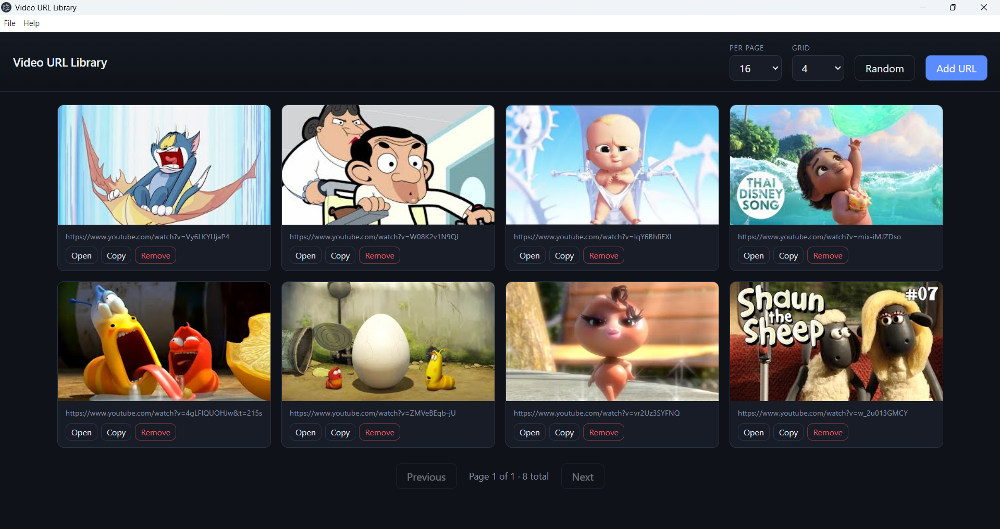

# Video URL Library

Desktop app built with Electron to save and manage video URLs with thumbnails and pagination.

## Features

- **Save URLs** — Add `http` / `https` links via a dialog; duplicates are rejected.
- **Thumbnails** — YouTube links use the standard preview image; other pages use **Open Graph** / **Twitter** image tags when available, otherwise a built-in placeholder.
- **Card grid** — Each entry shows the URL, preview, and actions (**Open** in the system browser, **Copy** to clipboard, **Remove** with confirmation).
- **Pagination** — Choose **items per page** (8–48) and move with **Previous** / **Next**; shows page count and total URLs.
- **Layout** — **Grid** column count (3–6); **per page** and **grid** choices are remembered (browser `localStorage`).
- **Random** — Shuffle the current list order on screen (does not rewrite the saved file).
- **PIN lock (optional)** — **Security → PIN settings…** to set, change, or remove a PIN (4–64 characters, stored hashed under app **userData**); unlock prompt when a PIN exists.
- **About** — **Help → About** opens a window with app summary and MRK Solution contact links (phone, social, portfolio).
- **Menu** — **File → Exit**, **Security**, **Help** (standard Electron application menu).

## Screenshot



## Requirements

- **Node.js** 18+ (recommended) and **npm**
- **Windows** for the default `npm run dist` / `npm run pack` flows below (NSIS installer and unpacked `dist/win-unpacked`). **macOS** builds (`npm run dist:mac`) must run [on a Mac](https://www.electron.build/multi-platform-build). **Linux** builds (`npm run dist:linux`) run on Linux (or WSL with appropriate setup).
- **Code signing** is optional for local builds; enable `build.win.signAndEditExecutable`, then set **`CSC_LINK`** and **`CSC_KEY_PASSWORD`** as in [Windows code signing](#windows-code-signing-pfx-and-env-vars) before `npm run dist` or `npm run pack`.

## Install

```bash
npm install
```

## Run in development

```bash
npm start
```

**Watch mode** (restart Electron when `src/`, `views/`, or `styles/` change):

```bash
npm run watch
```

Uses [nodemon](https://nodemon.io/) with `nodemon.json`. Or double-click **`start.bat`** for a normal start (`npm start` with Chrome remote debugging on port **8069**).

Development data is stored in **`storage/database.txt`** (one URL per line, **Base64-encoded** UTF-8; older plain `https://…` lines are still read correctly). Packaged builds use **userData** for the same filename.

### PIN lock

Use **Security → PIN settings…** to set, change, or remove a PIN (4–64 characters). If a PIN is set, it is stored (hashed) under the app **userData** folder as `pin-lock.json`; you must enter it each time the app opens.

## Project layout

```
video-url-library/
├── screenshot/     # README image(s)
├── src/              # main.js, preload.js, app.js, about.js
├── views/            # HTML
├── styles/           # CSS
├── storage/          # Dev database (database.txt)
├── images/           # icon.png (UI / macOS / Linux); icon.ico (Windows exe / taskbar)
├── dist/             # Created by pack/dist (gitignored until you build)
├── nodemon.json      # dev: npm run watch
├── package.json
├── package-lock.json
├── start.bat
└── README.md
```

Git also ignores certificate files like **`*.pfx`** (see `.gitignore`). The **`Video URL Library/`** entry in `.gitignore` is only relevant if you keep a copy of the built app at the repo root.

## Build

**Windows installer (NSIS `.exe` in `dist/`):**

```bash
npm run dist
```

**Unpacked Windows app** (portable-style folder; run **`dist/win-unpacked/Video URL Library.exe`** with `resources/` and `locales/` beside it):

```bash
npm run pack
```

Runs **electron-builder** **`--dir`** → **`dist/win-unpacked/`**.

**Other platforms** (targets are defined under `build.mac` and `build.linux` in `package.json`):

- **`npm run dist:mac`** — DMG and ZIP (Intel + Apple Silicon). Supported **only on macOS**.
- **`npm run dist:linux`** — AppImage and `.deb` (x64). Run on **Linux**.

By default **`build.win.signAndEditExecutable`** is **`false`** so Windows builds work without symlink privileges (electron-builder’s signing tools extract archives that use symlinks; without [Developer Mode](https://learn.microsoft.com/en-us/windows/apps/get-started/enable-your-device-for-development) or an elevated shell, that step fails).

### Windows code signing (PFX and env vars)

For **Authenticode signing**, set **`signAndEditExecutable`** to **`true`** in `package.json` → `build.win`, enable **Developer Mode** (or run the build from an elevated prompt), then set [environment variables](https://www.electron.build/code-signing) **in the same terminal session** before you run **`npm run dist`** or **`npm run pack`**.

**cmd**

```cmd
set CSC_LINK=C:\path\to\your-codesign.pfx
set CSC_KEY_PASSWORD=your-pfx-password
npm run dist
```

**PowerShell**

```powershell
$env:CSC_LINK = "C:\path\to\your-codesign.pfx"
$env:CSC_KEY_PASSWORD = "your-pfx-password"
npm run dist
```

Use the same `CSC_*` lines for an unpacked build; only the last command changes, for example `npm run pack`. Replace the paths and password with your real `.pfx` location and secret. More options (e.g. `CSC_NAME`) are described in the [electron-builder code signing](https://www.electron.build/code-signing) docs.
