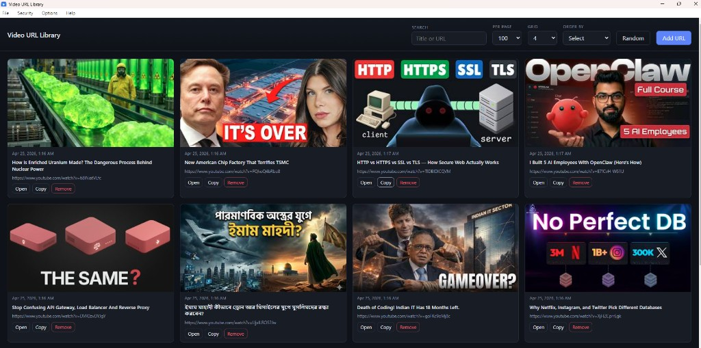
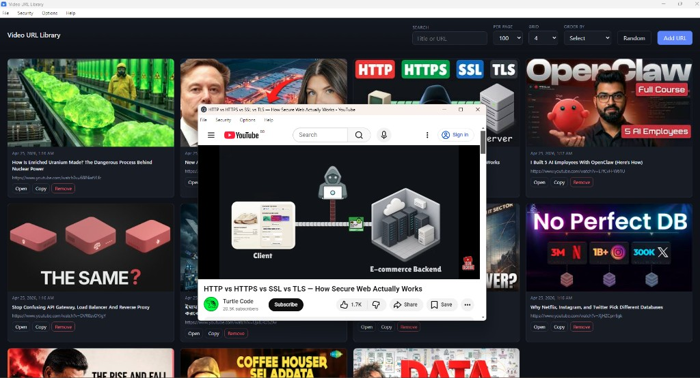
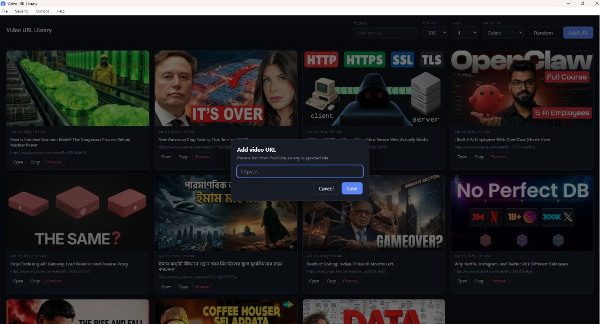

# Video URL Library

A **free, open-source** desktop app for Windows, macOS, and Linux. Save video and web URLs in a local library with **automatic thumbnails and titles**, search and sort, a **customizable card grid**, optional **PIN lock**, and **export / import** of your data.

**Repository:** [github.com/masudncse/video-url-library](https://github.com/masudncse/video-url-library)

[](LICENSE)
[](https://github.com/masudncse/video-url-library)

---

## Screenshots

| Main library (grid, search, controls) | Open link (in-app window) | Add URL dialog |
|:---:|:---:|:---:|
|  |  |  |

---

## Features

### Library and URLs

- **Add URL** — Paste any `http` / `https` link; duplicate URLs are rejected.
- **Metadata** — Page **title** from `og:title`, `twitter:title`, or `<title>` when the page is fetched.
- **Thumbnails** — YouTube links use the standard preview image; other sites use **Open Graph** / **Twitter** image tags when available, otherwise a built-in placeholder.
- **Storage** — Entries are stored as JSON: `{ id, timestamp, url, title }`. Development uses `storage/data.json`; packaged builds use the app **userData** folder. Legacy `database.json` / `database.txt` is migrated once on first run.

### Browsing and layout

- **Card grid** — Thumbnail, date added, title, URL, and actions **Open**, **Copy**, **Remove** (with confirmation).
- **Per page** — 8, 16, 24, 75, 100, 200, 300, or 500 items per page with **Previous** / **Next** pagination.
- **Grid columns** — 3–8 columns; layout adapts to the window.
- **Order by** — Sort by date added **ascending**, **descending**, or **random** display order (random does not rewrite the saved file).
- **Random** — One click to switch to a shuffled view (same as random sort).
- **Search** — Filter by **title** or **URL** (case-insensitive substring); search text is remembered.

### Options and security

- **Post view** — **Options → Setting**: show or hide **date & time**, **title**, and **URL** on each card (preferences in `localStorage`).
- **PIN lock (optional)** — **Security → PIN settings**: set, change, or remove a PIN (4–64 characters). Stored **hashed** (PBKDF2) in `pin-lock.json` under **userData**; unlock prompt when a PIN exists.
- **Export / Import** — **Options → Export** / **Import** for backups and moving libraries between machines.

### App shell

- **Menus** — **File** (Exit), **Security**, **Options**, **Help** (About).
- **About** — App summary and MRK Solution contact links (from the About window).
- **Open** — Opens the link in a new window (e.g. YouTube in an embedded-style view) or via system handling as configured by Electron.

---

## Tech stack

| Layer | Technology |
|--------|-------------|
| Desktop shell | [Electron](https://www.electronjs.org/) |
| Main process | Node.js — `fs` / `fs.promises`, `path`, `crypto` (PIN hashing), `http` / `https` for metadata and thumbnails |
| Renderer | Plain **HTML**, **CSS**, **JavaScript** (no React/Vue) |
| IPC | `contextBridge` + `ipcMain` / `ipcRenderer.invoke` |
| Packaging | [electron-builder](https://www.electron.build/) — Windows **NSIS** installer, macOS **DMG/ZIP**, Linux **AppImage** / **deb** |

---

## Libraries and tooling

Runtime is **Electron only** (no extra npm runtime dependencies).

| Package | Role |
|---------|------|
| `electron` | Desktop app framework and Chromium shell |
| `electron-builder` (dev) | Produce `.exe`, `.dmg`, `.AppImage`, `.deb`, etc. |
| `eslint` + `@eslint/js` + `globals` (dev) | Linting |
| `nodemon` (dev) | `npm run watch` — restart Electron when sources change |

Node **built-in** modules used in the main process include `crypto`, `fs`, `http`, `https`, `path`, and `url` for storage, PIN security, and fetching page/thumbnail data.

---

## Requirements

- **Node.js** 18+ and **npm**
- **Windows**: `npm run dist` / `npm run pack` for NSIS installer or unpacked `dist/win-unpacked`.
- **macOS**: run `npm run dist:mac` [on a Mac](https://www.electron.build/multi-platform-build).
- **Linux**: run `npm run dist:linux` on Linux (or a suitable CI environment).

---

## Install

```bash
git clone https://github.com/masudncse/video-url-library.git
cd video-url-library
npm install
```

---

## Run (development)

```bash
npm start
```

**Watch mode** (restart when `src/`, `views/`, or `styles/` change):

```bash
npm run watch
```

Uses [nodemon](https://nodemon.io/) (`nodemon.json`). On Windows you can also use **`start.bat`** for a normal start (`npm start` with Chrome remote debugging on port **8069**).

---

## Build from source

**Windows installer** (NSIS `.exe` in `dist/`):

```bash
npm run dist
```

**Unpacked Windows app** (folder you can zip or run locally — `Video URL Library.exe` inside `dist/win-unpacked/`):

```bash
npm run pack
```

**Other platforms** (see `build.mac` / `build.linux` in `package.json`):

```bash
npm run dist:mac
npm run dist:linux
```

---

## Download (pre-built Windows `.exe`)

**Direct download (NSIS installer, v1.0.0):**

[Video URL Library Setup 1.0.0.exe](https://github.com/masudncse/video-url-library/raw/main/downloads/Video%20URL%20Library%20Setup%201.0.0.exe)

Same URL as plain link (right-click → save, or paste in browser):

`https://github.com/masudncse/video-url-library/raw/main/downloads/Video%20URL%20Library%20Setup%201.0.0.exe`

You can also use **[GitHub Releases (latest)](https://github.com/masudncse/video-url-library/releases/latest)** when installers are attached there.

To build this file yourself: `npm run dist` (output in `dist/`), or copy into `downloads/` after building. For a portable folder: `npm run pack` → `dist/win-unpacked/`.

---

## Project layout

```
video-url-library/
├── downloads/       # Pre-built Windows NSIS installer (optional)
├── screenshots/       # README screenshots
├── src/              # main.js, preload.js, app.js, about.js
├── views/            # index.html, about.html
├── styles/           # styles.css
├── storage/          # Dev data (data.json); legacy DB files may exist until migrated
├── images/           # icon.png, icon.ico
├── dist/             # Build output (from pack/dist; typically gitignored)
├── nodemon.json
├── package.json
├── start.bat
└── README.md
```

---

## License

This project is licensed under the **MIT License** — see the `LICENSE` file if present in the repository, or the `license` field in `package.json`.

---

## Contributing

Issues and pull requests are welcome. For larger changes, open an issue first so we can agree on direction before you invest significant time.
